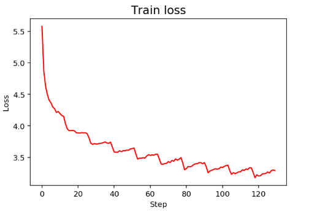

# TV Script with RNN

## Project overview

This project implements a recurrent neural network (LSTM) for training a language model. This model is used to generate a new text, based on the patterns it learned from the training data.

The dataset was composed of scripts from the Seinfeld TV show.

The project involves:

* Text processing, normalize and cleaning text: 
   * `helpers.py`: to preprocessing data and save it.
   * `problem_unittests.py`: a collection of functions to test the model.
   * `workspace_utils.py`: a collection of functions to run projects inside Udacity working environment.
* Train model: LSTM algorithm
* Generate new script

### Hyperparameters

Setting the hyperparameters is an important part in a deep learning project. The two most important parameters that control the model are `hidden_dim` and  `n_layers`. The `n_layers` paramater usually takes either 2 or 3. In this project it was set as 2. For `hidden_dim`, the most common values are 128, 256 or 512.

The final hyperparameters, the ones gave the lowest loss, were:

| Hyperparameters  | Value   | 
| -------------- | --------- |
| sequence_length  | 50      | 
| batch_size       | 128     | 
| embedding_dim    | 300     | 
| hidden_dim       | 256     | 
| n_layers         | 2       | 




In order to improve the model the parameters can be changed.

### Technologies used:

* Python, numpy
* Neural networks 
* RNN, LSTM
* jupyter notebook, anaconda

## Installation

Using [Anaconda](https://www.anaconda.com/products/individual), in an enviroment with python 3, install the following packages:

```
conda install jupyter, numpy, matplotlib 
conda install -c pytorch pytorch
```
